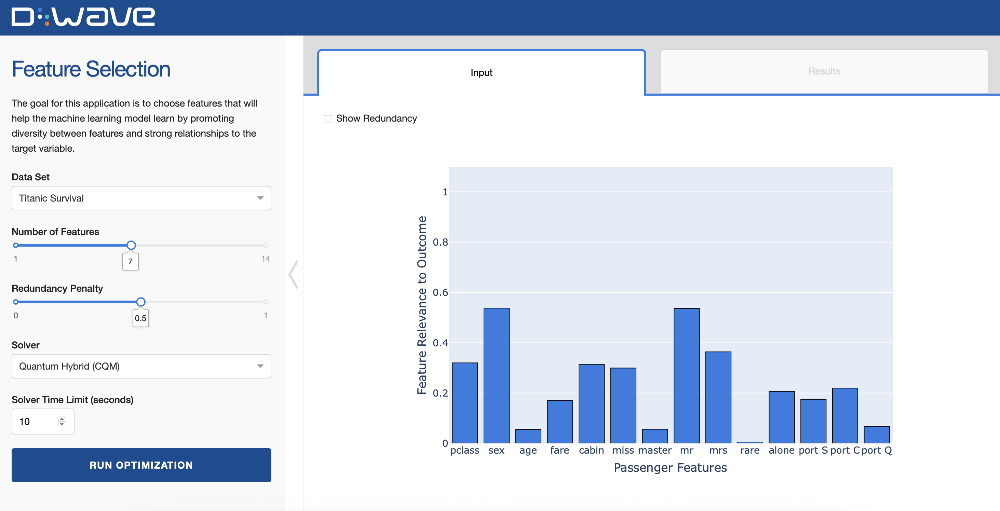

[](
  https://codespaces.new/dwave-examples/feature-selection-cqm?quickstart=1)

# Feature Selection Using Hybrid Quantum Solvers

This demo showcases feature selection using a nonlinear (NL) model
or a constrained quadratic model (CQM) via
[D-Wave's scikit-learn plug-in](https://github.com/dwavesystems/dwave-scikit-learn-plugin).



The demo can be used with two different datasets:

- `titanic`: This is a well-known dataset based on passenger survival from the
  Titanic.  It includes 14 features and illustrates how feature redundancy
  impacts the solution.
- `scene`: This is a larger dataset with 299 features.  It is associated with
  recognizing scenes based on feature data contained in images.  For additional
  information, see:
  [OpenML](https://www.openml.org/search?type=data&sort=runs&id=312&status=active).
  The features have generic labels such as "attr1" and are associated with image
  characteristics such as the mean or variance of different color channels
  within regions of the image.  As with the Titanic data, this dataset also
  illustrates the impact of feature redundancy.

---
**Note:** This example solves a CQM or NL model on a Leap&trade; quantum-classical
[hybrid solver](https://docs.dwavequantum.com/en/latest/concepts/hybrid.html).
The [MIQUBO Method of Feature Selection](https://github.com/dwave-examples/mutual-information-feature-selection)
example solves this same problem using a
[binary quadratic model (BQM)](https://docs.dwavequantum.com/en/latest/concepts/models.html#binary-quadratic-models)
directly on a D-Wave quantum computer's quantum processing unit (QPU).

---

## Installation

You can run this example without installation in cloud-based IDEs that support
the
[Development Containers specification](https://containers.dev/supporting) (aka
"devcontainers") such as GitHub Codespaces.

For development environments that do not support `devcontainers`, install
requirements:

```bash
pip install -r requirements.txt
```

If you are cloning the repo to your local system, working in a
[virtual environment](https://docs.python.org/3/library/venv.html) is
recommended.

## Usage

Your development environment should be configured to access the
[Leap&trade; quantum cloud service](https://docs.dwavequantum.com/en/latest/ocean/sapi_access_basic.html).
You can see information about supported IDEs and authorizing access to your Leap
account
[here](https://docs.dwavequantum.com/en/latest/ocean/leap_authorization.html).

Run the following terminal command to start the Dash application:

```bash
python app.py
```

Access the user interface with your browser at http://127.0.0.1:8050/.

The demo program opens an interface where you can configure problems and submit these problems to
a solver.

Configuration options can be found in the [demo_configs.py](demo_configs.py) file.

> [!NOTE]\
> If you plan on editing any files while the application is running, please run the application
with the `--debug` command-line argument for live reloads and easier debugging:
`python app.py --debug`

A dropdown menu is provided to choose the dataset.

To visualize feature redundancy, first activate the "Show redundancy" check box.
Then hover the mouse over any of the bars.  The colors of all bars will be
dynamically updated to show the similarity (redundancy) against the feature that
is currently under the mouse. A higher value (closer to 1.0) indicates that the
feature is very redundant with the current feature, while a lower value
(closer to 0.0) indicates a feature that is less redundant and may potentially
provide new information for the model.

Click on the `Solve` button to run the feature selection with the given settings
(each dataset is initialized with reasonable default settings for the number of
features and redundancy penalty).  Solutions typically take 1-3 seconds.  Once
complete, the bar chart will update to reflect the selected features, and the
bar graph for accuracy scores will also be updated.

## Problem Description

The goal for this feature selection application is to choose features that will help 
the machine-learning model learn by promoting diversity between features and strong
relationships to the target variable. The model sets the following objectives and constraints 
to achieve this goal:

**Objectives:**  minimize the redundancy metric (correlation between features) between each 
pair of features to promote diversity and maximize correlation between features and the target
to promote a strong relationship. 

**Constraints:** choose the requested number of features.

## Model Overview

In this example we use the Titanic and Scene datasets to generate a CQM or NL model. 
The datasets are assumed to be clean, meaning there are no missing entries or repeated features. 
The features of the dataset are used to build a correlation matrix which compares the features to 
each other as well as a correlation matrix that compares the features to the target variable. Those 
correlation matrices are used to build the objective function. 

---
**Note:** Although a model overview is provided here, all of the code to build
the feature selection model is contained within 
[D-Wave's scikit-learn plug-in](https://github.com/dwavesystems/dwave-scikit-learn-plugin).

---

### Parameters

These are the parameters of the problem:

- `num_features`: the number of features to select 
- `redund_value`: used to determine factor applied to redundancy terms
  - 0: features will be selected as to minimize the redundancy without any consideration to quality
  - 1: places the maximum weight on the quality of the features

### Variables
- `x_binary`: binary variable that shows a list of which features are selected (1) and not selected (0)

### Objective
The objective function has two terms. The first term minimizes the correlation between 
chosen features in the dataset (this term is weighted by the redundancy parameter, `redund_val`). The 
second term maximizes the correlation between the features and the target variable. 

### Constraints
A single constraint is used to require that the model select a number of features equal to the `num_features`
parameter.

## Code Overview

Given a selected value for the `num_features` and `redund_value` sliders, the code proceeds as follows:

* The selected dataset and parameters are passed to D-Wave's feature selection scikit-learn plugin
* The resulting selected features are returned from the plugin
* A random forest classifier model is trained on the selected features and accuracy score is calculated
* The display image is updated to reflect the selected features and the classifier accuracy 

## References

Milne, Andrew, Maxwell Rounds, and Phil Goddard. 2017. "Optimal Feature
Selection in Credit Scoring and Classification Using a Quantum Annealer."
1QBit; White Paper.
https://1qbit.com/whitepaper/optimal-feature-selection-in-credit-scoring-classification-using-quantum-annealer/
